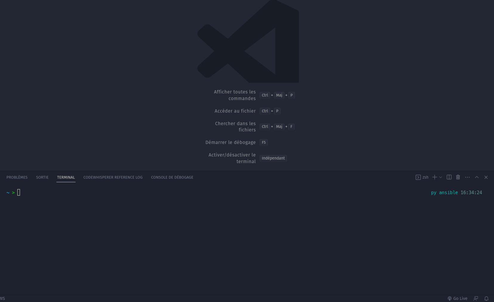

# Stephane ROBERT ansible Snippets for Visual Studio Code

This Visual Studio Code extension has snippets to help you write your Ansible
code when you are recommendations on myb [personal blog](https://blog.stephane-robert.info/)

<!-- set_fact, stat, blockinfile, lineinfile, assert, includes, wait_for, import_tasks, unarchive
- name: Add os specific variables
  ansible.builtin.include_vars: "{{ loop_vars }}"
  with_first_found:
    - files:
        - "{{ ansible_distribution | lower }}-{{ ansible_distribution_version }}.yml"
        - "{{ ansible_distribution | lower }}-{{ ansible_distribution_major_version }}.yml"
        - "{{ ansible_distribution | lower }}.yml"
        - "{{ ansible_os_family | lower }}.yml"
        - "{{ ansible_system | lower }}.yml"
        - "main.yml"
      paths:
        - "vars"
  loop_control:
    loop_var: loop_vars -->